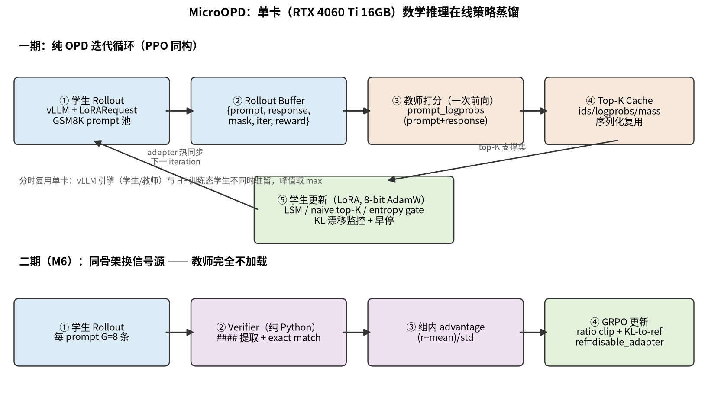

# MicroOPD：单卡数学推理在线策略蒸馏系统

实现 Qwen3-8B（教师，FP8）→ Qwen3-1.7B（学生，BF16 + LoRA r16）的数学推理**在线策略蒸馏（On-Policy Distillation, OPD）**，数据集 GSM8K。核心组件：迭代式 rollout buffer + Top-K Cache（教师评分序列化复用）+ LSM 损失（Local Support Matching，支撑集内重归一化 KL）+ Mass Coverage 评测；二期在 OPD 收敛后接入 GSM8K 可验证奖励做短训 GRPO，验证"verifier 信号突破蒸馏天花板"的混合路线。

本项目是 OPD/LSM 文献的**复现 + 消融验证**，不声称方法创新。全部数字来自真实跑出的结果（`runs/` 下有原始记录），未跑出的不写数，负结果如实记录。



## 数据

GSM8K（Grade School Math 8K）是一个数学推理数据集，包含 8,000 道题目，主要用于评估模型的数学推理能力。训练用 train split，全量评测用 test split（1319 题）；答案提取规则为 `####` 后的数值，chat template 师生统一。

## 主要流程

| 阶段 | 方法 | GSM8K acc（全量 1319） | 平均长度 | 说明 |
|---|---|---|---|---|
| 1. Baseline | Qwen3-1.7B 未训练 | 78.5% | 196 | 自有管线实测基线（非官方数字） |
| 2. SFT | 教师 Qwen3-8B 轨迹监督微调 | 79.9% | 229 | +1.4pt，离线蒸馏对照 |
| 3. OPD | naive top-K（K=64） | **82.4%** | 246 | 在线蒸馏 baseline（forward 方向截断 CE），acc 最高 |
| 3. OPD | LSM（K=64） | 80.7% | 243 | 支撑集内双侧重归一化 reverse KL，价值在稳定性（loss 方差 −67%） |
| 4. 熵门控 | LSM + entropy gate（K=64） | 80.6% | 245 | 本设置下无 acc 增益（如实记录） |
| 5. GRPO | OPD→GRPO 短训（GSM8K 可验证奖励） | 82.0% | 247 | 从 LSM K=8 adapter 热启动，相对锚点零提升 |
| 5. GRPO | OPD→GRPO 长训（4× 规模） | 82.3% | 247 | lr 1e-6 × 30 iter × 64 prompts；+0.4pt vs 锚点，噪声带内（倾向正面） |
| 5. 对照 | pure OPD 续训（同锚点短训） | 82.0% | 257 | 与短训 GRPO 打平 |

## 具体细节

### 1. 在线策略蒸馏闭环（PPO 同构）

每个 iteration 依次执行：

1. **学生采样**：vLLM 批量生成，$y \sim \pi_S(\cdot|x)$（`enable_thinking=False`，max_new_tokens=512）；
2. **教师打分（一次前向，非重新生成）**：把 response 拼进 prompt，用 `prompt_logprobs` 逐位置取出以学生历史 token 为条件的教师分布

$$q_t(v) = p_T\big(v \;\big|\; x, y_{<t}\big)$$

   这是 OPD 区别于离线蒸馏的关键：教师评估的是**学生自己走出来的轨迹**，退化为 `teacher.generate()` 则变回 SFT；
3. **Top-K Cache**：打分结果序列化落盘，教师随即卸载，学生训练期间教师不占卡（16GB 单卡分时复用，峰值取 max 不取 sum）；
4. **学生 LoRA 更新**：N 步内层更新 + KL 漂移监控，见第 5 节。

### 2. Top-K Cache

每个 response 位置 $t$ 只保存教师分布的 top-K 支撑集及其 logprob：

$$S_t = \operatorname{top-}K(q_t), \qquad M_t = \sum_{v \in S_t} q_t(v)$$

派生量：教师 top-K mass $M_t$（截断长尾的度量）、支撑集内熵。教师评分全程只发生一次，跨内层更新复用。

### 3. LSM 损失（Local Support Matching）

top-K 截断后师生两侧分布都不归一（$\sum_{v \in S_t} q_t(v) < 1$），直接算 KL 有截断偏差。LSM 在**支撑集内双侧重归一化**后计算 reverse KL（= KL(学生‖教师)，期望在学生分布下取，student-weighted / mode-seeking，与 [LSM 论文](https://arxiv.org/abs/2603.25562) Eq. (8) 及 MiniLLM 的约定一致）：

$$\hat{q}_t(v) = \frac{q_t(v)}{\sum_{u \in S_t} q_t(u)}, \qquad \hat{p}_t(v) = \frac{p_t(v)}{\sum_{u \in S_t} p_t(u)}$$

$$\mathcal{L}_{\mathrm{LSM}} = \mathbb{E}_t\Big[\, \mathrm{KL}\big(\hat{p}_t \,\big\|\, \hat{q}_t\big) \Big] = \mathbb{E}_t \sum_{v \in S_t} \hat{p}_t(v) \log \frac{\hat{p}_t(v)}{\hat{q}_t(v)}$$

- 只归一化一侧是 Mass Coverage 不升反降的典型实现错误；
- **K=1 退化陷阱**：单元素支撑集上双侧重归一化使 KL 恒等于 0（无梯度），按退化链语义改为教师 argmax 交叉熵 ≈ SFT。退化链：SFT ⊂ top-K OPD ⊂ full-vocab OPD。

### 4. naive top-K（对照 baseline）

截断后**不做任何重归一化**：

$$\mathcal{L}_{\mathrm{naive}} = \mathbb{E}_t \sum_{v \in S_t} q_t(v) \log \frac{q_t(v)}{p_t(v)}$$

截断长尾（$1 - M_t$）的质量被静默丢弃，loss 尺度随 mass 漂移，作为 LSM 的对照。

### 5. 熵感知门控（entropy gate，M4）

reverse KL 在低熵 token 上合理（mode-seeking），但 top-K 截断使熵系统性偏低，高不确定 token 上纯 reverse 会过度 mode-seeking（输出坍缩风险）。按 token 在 reverse / forward KL 之间 sigmoid 插值：

$$f_t = \underbrace{-\frac{\sum_v \hat{q}_t(v)\log \hat{q}_t(v)}{\log K}}_{\text{支撑集内归一化熵}} + \underbrace{(1 - M_t)}_{\text{截断长尾}}, \qquad w_t = \sigma\big(g \cdot (f_t - \tau)\big)$$

$$\mathcal{L}_{\mathrm{gate}} = \mathbb{E}_t\Big[ (1 - w_t)\,\mathrm{KL}\big(\hat{p}_t \| \hat{q}_t\big) + w_t\,\mathrm{KL}\big(\hat{q}_t \| \hat{p}_t\big) \Big]$$

低熵 token $w_t \to 0$ 走 reverse（KL(学生‖教师)，mode-seeking），高熵 token $w_t \to 1$ 走 forward（KL(教师‖学生)，mass-covering）。其中 $M_t$ 为**重归一化之前**的教师 top-K 原始概率质量。

### 6. KL 漂移监控（on-policy 保险丝）

内层 N 步更新期间，样本来自 iteration 开头生成 rollout 时的策略 $\pi_{old}$，逐步估算当前策略相对它的漂移：

$$\mathrm{drift} \approx \mathbb{E}_{y \sim \pi_{old}}\big[\log \pi_{old}(y_t) - \log \pi_{cur}(y_t)\big] \approx \mathrm{KL}\big(\pi_{old} \,\big\|\, \pi_{cur}\big)$$

基准每个 iteration 重置（锚定在数据生成时刻的策略，而非初始模型）。drift 超阈值（0.05）提前终止本轮内层更新，进入下一轮重新 rollout——这是"buffer 还算 on-policy"的标准答案。

### 7. 二期 GRPO（Group Relative Policy Optimization）

OPD 收敛后换信号源：教师完全不加载，改用 GSM8K exact-match 可验证奖励。同 prompt 采样 $G$ 条轨迹，组内归一化 advantage：

$$A_i = \frac{r_i - \mathrm{mean}(\mathbf{r})}{\mathrm{std}(\mathbf{r}) + \epsilon}$$

零方差组（全对/全错）advantage 全零无梯度，整组跳过。PPO 式重要性比 clip：

$$\mathcal{L}_{\mathrm{GRPO}} = -\mathbb{E}_t \min\Big(\rho_t A_i,\ \operatorname{clip}(\rho_t, 1-\epsilon, 1+\epsilon)\, A_i\Big) + \beta \cdot \mathrm{KL}\big(\pi_{ref} \,\big\|\, \pi_{cur}\big)$$

其中 $\rho_t = \exp(\log \pi_{cur} - \log \pi_{old})$；KL 用 k3 估计子 $\exp(\Delta) - \Delta - 1 \ge 0$；ref 分布由同一权重 `disable_adapter` 免费获得（零额外显存）。只给 exact-match 主 reward，防 reward hacking；lr 比一期低一个量级。

### 8. 评测指标

- **GSM8K accuracy**：全量 1319 题，贪婪解码，提取 `####` 后数值做 exact match；
- **Mass Coverage**：学生分布在教师 top-K 支撑集上的全词表概率质量

$$\mathrm{MC} = \mathbb{E}_t \sum_{v \in S_t} p_t(v)$$

  直接检验 LSM 的前提假设（学生质量是否集中在教师支撑集内），是结果也是诊断；
- **Top1 match**：教师 top-1 token 是否为学生支撑集内 argmax（近似，学生全词表 argmax 可能在支撑集外，约定注明）。

## 结果汇总

### 主结果（GSM8K 全量 1319 题）

| 方法 | acc | 平均长度 | 提取失败率 | 训练峰值显存 | 墙钟 |
|---|---|---|---|---|---|
| 教师 Qwen3-8B-FP8（参照上限） | 93.3% | 237 | 0.7% | — | — |
| Base（Qwen3-1.7B 未训练） | 78.5% | 196 | 1.3% | — | — |
| SFT（教师轨迹） | 79.9% | 229 | 1.4% | 5.06 GB | 0.9 h |
| **naive top-K OPD（K=64）** | **82.4%** | 246 | 2.0% | 4.91 GB | 0.6 h |
| LSM OPD（K=64） | 80.7% | 243 | 1.9% | 4.90 GB | 0.6 h |
| LSM + entropy gate（K=64） | 80.6% | 245 | 2.1% | 4.83 GB | 0.6 h |
| OPD→GRPO（M6 短训） | 82.0% | 247 | 1.5% | 6.83 GB | 0.6 h |
| OPD→GRPO 长训（M6，4× 规模） | 82.3% | 247 | 2.2% | 6.92 GB | 2.1 h |
| pure OPD 续训（M6 对照，短训） | 82.0% | 257 | 2.1% | 4.76 GB | 0.6 h |

结论链：Base 78.5 < SFT 79.9 < OPD 各变体（80.6–82.4）。**在线蒸馏本身显著优于 SFT 的论点成立**；但 reverse-KL LSM 在 acc 上未胜 naive（见下）。教师上限为同一管线实测的 93.3%（`scripts/eval_teacher.py`，协议与学生评测一致；官方 4-shot ≈90 只是区间参照），最优学生 82.4% 距教师仍有 ~11pt，说明蒸馏远未触顶，瓶颈在学生容量/训练预算而非教师信号质量。

### K 消融（LSM vs naive top-K，全量 1319）

| K | LSM | naive top-K |
|---|---|---|
| 1 | 81.0% | ≡ LSM（共用，不重复训练） |
| 8 | **82.0%** | 81.1% |
| 32 | **82.2%** | 82.0% |
| 64 | 80.7% | **82.4%** |

LSM 在小 K（8/32）略胜 naive，K=64 反负；LSM 的明确优势在**训练稳定性**：loss 方差 0.0062 vs naive 0.0186（**−67%**），与 LSM 论文"提升优化稳定性"的主张一致，acc 优势在本小规模设置下未复现。

### 分布一致性（n=16 抽查，验证蒸馏假设）

| 指标 | LSM K=64 | LSM+gate K=64 |
|---|---|---|
| Top1 match | 0.945 | 0.953 |
| Mass Coverage | 0.9999 | 1.0000 |

### MATH-500 分布外迁移（n=500，负结果）

| 模型 | acc | 平均长度 |
|---|---|---|
| Base | 48.6% | 383 |
| LSM OPD（K=8） | 46.8% | 399 |
| OPD→GRPO | 46.6% | 397 |

分布外迁移为负结果：OPD 与 GRPO 均略低于 Base，GRPO 相对 OPD 锚点亦无回升。

### 修正记录（如实）

本仓库早期实现把 LSM 的 KL 方向写成了 KL(教师‖学生)（forward），与 LSM 论文（arXiv 2603.25562）定义的 reverse KL = KL(学生‖教师) 相反；entropy gate 的 rev/fwd 标签随之整体互换，且门控特征中的 (1−mass) 项因取重归一化后的概率（恒为 1）而成为死代码。修正为论文方向并修复 mass 后全链路重跑，主要变化：

- LSM+gate 83.4% → 80.6%（旧实现的"最优"结论不成立，gate 无增益）；
- GRPO 82.8% vs OPD 续训 82.0% 的"verifier 突破天花板"结论 → 短训打平（82.0% vs 82.0%，且相对锚点零提升；策略几乎未动，命题当时未被检验）；**加大规模复验（4×）：0.8234，相对锚点 +0.4pt，噪声带内、倾向正面**（见"核心发现"第 5 条）；
- LSM 的稳定性优势（loss 方差 −67%）与 MC≈1 的蒸馏假设验证不受影响，依然成立。

## 核心发现

1. **Base < SFT < OPD**：0.785 < 0.799 < 0.806–0.824（±1.1pt 为 95% CI）。在线蒸馏相对 SFT 一致更优，相对 Base +2.1pt 起。
2. **退化链实证**（`runs/m7/figs/k_ablation.png`）：K=1 的 OPD（退化为教师 argmax 交叉熵）acc 0.810 ≈ SFT 0.799 < K≥8 OPD 0.806–0.824，即 SFT ⊂ top-K OPD ⊂ full-vocab OPD。
3. **LSM 修的是稳定性不是幅度**：naive top-K 的 loss 方差是 LSM 的 3 倍（0.0186 vs 0.0062）；acc 两者互有胜负（小 K 时 LSM 略胜，K=64 时 naive 反胜 1.7pt）——与 LSM 论文"提升优化稳定性"的主张一致，acc 优势在本小规模设置下未复现，如实记录。
4. **entropy gate（M4）无增益**：0.806 vs LSM 0.807（噪声带内打平）。修正 KL 方向与 mass 死代码后重跑的结论；旧（方向错误的）实现曾显示 +1.7pt，不可复现，见"修正记录"。
5. **M6 混合路线：短训打平、长训微升（噪声带内）**。同锚点（LSM K=8, 0.8196）：短训 GRPO 与 pure OPD 续训均为 0.8196，训练动态显示策略几乎未动（ratio≈1.0000，112 步 × lr 5e-7）——命题当时**未被检验**。加大到 4× 规模（lr 1e-6、30 iter、64 prompts、240 steps）后策略真正移动（KL-to-ref 累计 ~0.11，短训 ≈0），acc **0.8234**（+0.4pt，+5/1319），方向符合"verifier 信号有增益"的预期，但幅度在 ±1.1pt 噪声带内，结论为**倾向正面、未达统计显著**。GRPO 长训健康：457 步无 nan、grad_norm 均值 ~0.3 无尖峰、零方差组正常跳过。
6. **KL 漂移监控（M5）**：`runs/m7/figs/kl_drift.png` 呈典型锯齿——迭代内漂移上升、触阈值 0.05 提前刷新 rollout 归零。这是"还算 on-policy"的答案：训练循环与 PPO 同构（每 iteration 刷新数据 + N 步内更新 + 漂移门控），也正因如此 M6 接 GRPO 只换了 loss 和信号源。

## 关键工程发现（协议修正，M2 实证）

最初按 256 token 预算评测时，**全部方法（含 Base）acc 被系统性压低约 12pt**（Base 0.660→0.785）：教师 non-thinking 风格 verbose（均值 202 token、32.5% 截断），风格经蒸馏迁移后学生在 256 内收不了尾，`####` 提取失败率从 1.3% 涨到 21%。修正为训练/评测统一 512 后一切回归正常。**教训：生成预算必须与教师实际长度分布自洽，否则任务指标测量的是截断而非能力。**

## 负结果与 limitation

- **SFT baseline 在 256 预算下是负结果**（acc 0.73→0.58）：教师轨迹 32.5% 截断，拒绝采样过滤后学生仍学会 verbose 不收尾。512 预算下 SFT 恢复为正（0.799），但仍低于 OPD。
- **K=1 的"自然退化"是恒零陷阱**：单元素支撑集上师生双侧重归一化使 KL≡0（无梯度）。正确退化语义是教师 argmax CE（学生对全词表归一化），本实现修正后 K=1 才有训练信号（见 `losses/base.py: k1_argmax_ce`）。
- **LoRA 容量**：词表/输出头不变，分布层面信号完整；容量受限是 16GB 约束下的 fair trade-off。
- **GRPO 增益幅度小**：短训（15 iter × 32 prompts × lr 5e-7）相对锚点零提升（策略几乎未动）；4× 规模（lr 1e-6 × 30 iter × 64 prompts）后 +0.4pt（0.8196→0.8234），方向正面但仍在 ±1.1pt 噪声带内——单卡可及的规模下，"verifier 突破蒸馏平台"只能得到倾向性证据，决定性验证需要更大规模。
- **教师 FP8 是官方预量化 checkpoint**（Qwen3-8B-FP8）：vLLM 动态 FP8 量化路径会先把 BF16 权重全量上卡（~14GB），16GB 卡装不下；预量化直接加载 FP8 权重（8.8 GiB）。与 BF16 教师的精度差异未单独测量。
- **MATH-500 迁移测试（一次性，分布外）**：Base 0.486 / LSM K=8 0.468 / GRPO 0.466。GSM8K 上的蒸馏在分布外付出约 2pt，GRPO 相对 OPD 锚点亦无回升——"学到推理能力而非格式特化"的佐证不成立，如实记录（原始数据 `runs/m7/math500.json`）。

## 复现

```bash
# 环境（Python 3.11）
pip install -r requirements.txt   # vllm==0.8.5.post1, torch 2.6.0, transformers 4.57.x, peft, bitsandbytes...

# 模型（huggingface.co 不可达时走 ModelScope）
modelscope download --model Qwen/Qwen3-1.7B --local_dir pretrained/Qwen3-1.7B
modelscope download --model Qwen/Qwen3-8B-FP8 --local_dir pretrained/Qwen3-8B-FP8

# M0 冒烟（显存验收 + Base 全量评测）
python scripts/smoke_m0.py

# M1 最小闭环（10 条样本）
python scripts/run_iteration.py

# M2/M3 实验（OPD / SFT / 各 K 消融）
python scripts/run_experiment.py --config configs/base.yaml              # LSM K=64
python scripts/run_experiment.py --config configs/sft.yaml               # SFT baseline
python scripts/run_experiment.py --config configs/ablation/k8.yaml       # 等

# M6 二期（需先有一期 checkpoint）
python scripts/run_experiment.py --config configs/grpo.yaml --phase2     # GRPO
python scripts/run_experiment.py --config configs/opd_continue.yaml      # pure OPD 续训对照

# 全量评测 + 出图
python scripts/final_eval_all.py
python scripts/make_figures.py
```

超参全部在 `configs/*.yaml`（含评测协议：贪婪、0-shot、`####` 提取、max_new_tokens=512），代码里无写死超参。

## 训练循环（一期）

```
Iteration t:
  ① 学生 rollout（vLLM + LoRARequest 热同步 adapter，temp=1.0）
  ② rollout buffer（版本对齐，只消费当前 iter 数据）
  ③ 教师打分：prompt_logprobs(prompt + student_response) 一次前向，绝不 generate
  ④ Top-K Cache 落盘复用（教师评分只发生一次，训练时教师不占卡）
  ⑤ LSM 更新 N 步（8-bit AdamW，仅 LoRA 参数；logits 分 chunk gather）
     KL 漂移 > 0.05 → 提前进入下一轮
```

显存纪律：vLLM 引擎与 HF 训练态分时复用单卡（峰值取 max）；vLLM V1 引擎子进程必须显式 `engine_core.shutdown()` 并等显存回落，否则残留 ~11GB（实测踩坑）。

## 参考文献

- Teacher Top-K LSM 出处：[Revisiting On-Policy Distillation: Empirical Failure Modes and Simple Fixes](https://arxiv.org/abs/2603.25562)（本项目为复现+消融，非方法创新）
- [GKD: Generalized Knowledge Distillation for Auto-regressive Sequence Models](https://arxiv.org/abs/2306.13649)（on-policy 蒸馏框架）
- [DeepSeekMath: GRPO](https://arxiv.org/abs/2402.03300)（组内 advantage + ratio clip + KL-to-ref）
- Thinking Machines Lab: On-Policy Distillation（工程实践参照）

## 目录

```
configs/      全部实验配置（base / ablation / sft / grpo / opd_continue）
models/       学生（HF+LoRA）与教师（vLLM FP8）加载/卸载/权重同步
rollout/      学生采样、教师 prompt_logprobs 打分、buffer
cache/        Top-K Cache 序列化 + mass/entropy 派生
losses/       lsm / naive_topk / entropy_gate / sft / grpo + 共享 gather 算子
trainer/      N 步更新 + KL 漂移监控（PPO 同构）
evaluation/   gsm8k / agreement / verifier / math500
scripts/      smoke_m0 / run_iteration / run_experiment / final_eval_all / make_figures / eval_math500
runs/         每次实验的全部原始记录（config、metrics、eval、figs、adapters）
```
